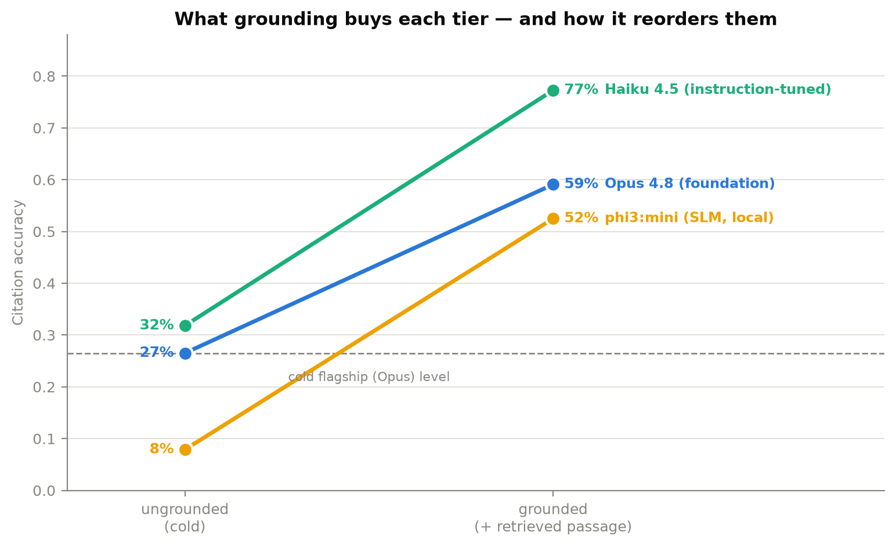
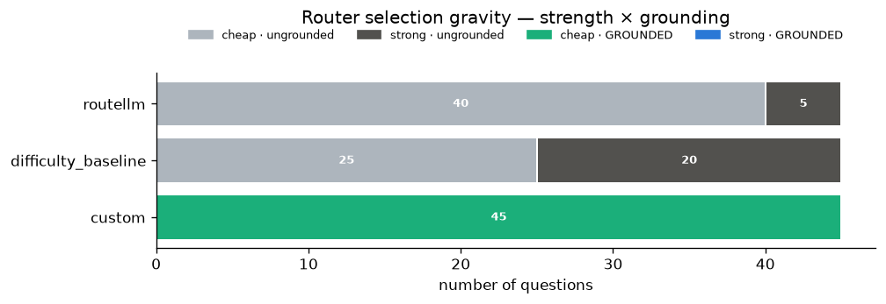

# Can an LLM correctly cite the Florida Building Code?

**A measured tutorial series on model-tier selection and grounding — three model tiers, cold vs. grounded, scored with a deterministic citation-match metric against the published code text.**

45 real questions about the 2023 8th-Edition Florida Building Code and the Naples/Collier County local amendments, each with a gold section citation verified against the published text. Every number below regenerates from the committed raw results via [`analysis/benchmark_report.ipynb`](analysis/benchmark_report.ipynb).

**→ Full synthesis with method, caveats, and the router study: [FINDINGS.md](FINDINGS.md)**

## Headline results

| tier | cold — correct / wrong / abstain | grounded — correct / wrong / abstain | Δ correct |
|---|---|---|---|
| Claude Opus 4.8 (foundation role) | 26.5% / 31.8% / 41.7% | **59.1%** / 11.4% / 29.5% | +32.6 |
| Claude Haiku 4.5 (instruction-tuned, forced JSON schema) | 31.8% / 67.4% / 0.8% | **77.3%** / 22.7% / 0.0% | +45.5 |
| phi3:mini (~3.8B SLM, local Ollama) | 7.9% / 39.4% / 52.8% | **52.5%** / 12.5% / 35.0% | +44.6 |

*Cold = parametric memory only, 45 questions × 3 repeats (scoreable n = 132/132/127). Grounded = the correct code passage injected as context, single pass (n = 44/44/40). "Wrong" = cited a section the published code doesn't assign — a hallucinated citation.*



Three findings carry the series:

1. **Cold, no tier is usable — and each fails differently.** The flagship *abstains* (42%, calibrated honesty), the schema-forced cheap model *fabricates* (67% wrong — its required `section` field forbids "I don't know"), and the small local model simply *doesn't know* (7.9% correct). A schema guarantees a parseable answer, never a correct one.
2. **Grounding rescues the cheap local model.** Retrieval lifts every tier by 33–46 points; grounded phi3 (52.5%, on a laptop, ~free, offline) beats *cold* Opus (26.5%) by ~2×. **Cheap local model + good retrieval beats an expensive model alone.**
3. **Grounding is a separate axis that belongs *in front of* model routing.** Off the shelf, every router we dry-ran (RouteLLM, NotDiamond) routes 100% ungrounded — not because they're bad, but because grounding is a pipeline decision outside the "pick a model" abstraction. Ground the prompt yourself and *train* NotDiamond's custom router on your own scores, and it lands cheap + grounded on its own — matching the hand-built router:



## Quickstart — reproduce a cold run for $0 in ~15 minutes

Gemini's free tier covers the whole benchmark; no paid key needed.

```bash
git clone https://github.com/dotnetspark/fbc-model-routing-benchmark.git
cd fbc-model-routing-benchmark
pip install -r requirements.txt            # Python 3.11+

# Free key from https://aistudio.google.com → put it in .env:
#   GEMINI_API_KEY=...

python run_benchmark.py --model-class foundation_gemini --repeats 1 --limit 5   # smoke test
python run_benchmark.py --model-class foundation_gemini                          # full cold run, $0
```

Each run writes one JSON line per request to `results/<model_class>_raw.jsonl` and prints a latency/cost/citation summary. A result line looks like:

```json
{"model_class": "foundation", "model_name": "claude-opus-4-8", "question_id": "q001",
 "output": "…", "latency_ms": 7157.1, "input_tokens": 45, "output_tokens": 467,
 "cost_usd": 0.0119, "cited_section": "10", "error": null}
```

Then regenerate every chart and table from the raw results:

```bash
jupyter nbconvert --to notebook --execute --inplace analysis/benchmark_report.ipynb
```

## The lessons

Each lesson: **Concept → why it matters for routing → build increment → measured checkpoint** (the checkpoint shows the reference run's actual numbers, so you know what you should see). Work through them in order.

| lesson | what you build & measure | time | API cost |
|---|---|---|---|
| [01 — Foundation LLMs](lessons/01-foundation-llms.md) | the harness, the 45-question gold set, the cold flagship baseline | ~2 h | $0 (Gemini) or ~$1.40 (Opus) |
| [02 — Instruction-tuned models](lessons/02-instruction-tuned-models.md) | forced-JSON-schema client; the structured-output trap | ~1 h | ~$0.05 |
| [03 — Small language models](lessons/03-small-language-models.md) | local phi3:mini via Ollama; honest cost accounting | ~1 h (+ ~2.5 h unattended CPU inference) | $0 |
| [04 — Multimodal models](lessons/04-multimodal-models.md) | *design note — no reference run in this repo* | — | — |
| [05 — Fine-tuned models](lessons/05-fine-tuned-models.md) | *design note — no reference run in this repo* | — | — |
| [06 — RAG-integrated models](lessons/06-rag-integrated-models.md) | grounding corpus verified against published text; the cold→grounded deltas | ~2 h (corpus verification is the real work) | ~$0.60 |
| [07 — When to use each model type](lessons/07-when-to-use-each-model-type.md) | router dry-run study: RouteLLM, NotDiamond (default + trained), custom | ~2 h | $0 dry-run (+ ~$0.30 optional NotDiamond training) |

## Repository layout

```
├── README.md                    ← results overview + quickstart (you are here)
├── FINDINGS.md                  ← the full synthesis — start here for the analysis
├── LESSON7_PLAN.md              ← design + honesty guardrails for the router study
├── project.md                   ← original architecture/scope plan
├── requirements.txt
├── run_benchmark.py             ← the only place inference happens (Lessons 1–3, 6)
├── run_router_dryrun.py         ← Lesson 7: records each router's selections
├── run_notdiamond_training.py   ← Lesson 7: trains NotDiamond's custom router on our scores
├── docker/  docker-compose.yml  ← Linux env for the router stack (RouteLLM won't install on Windows)
├── lessons/                     ← the tutorial series (01–07)
├── clients/                     ← model clients + the shared regex citation extractor (the metric)
├── routers/                     ← router adapters: custom lookup, RouteLLM, NotDiamond, heuristic
├── data/                        ← gold questions, verified grounding excerpts, source corpus PDFs
├── results/                     ← committed raw results (.jsonl), charts, summary tables
└── analysis/                    ← benchmark_report.ipynb (regenerates every number) + router comparison
```

## Why this domain

- The Florida Building Code and the Naples/Collier local amendments are public documents with clear, checkable answers — so the metric can be a **deterministic regex section-citation match**, not an LLM judge. Correct / wrong / abstained are unambiguous.
- Code text is dense, cross-referenced, and frequently amended — a genuine stress test for parametric memory, grounding, and hallucination detection. The local-jurisdiction questions (22 of 45) are the narrowest, least-trained-on material, which is exactly where the interesting failures live.
- The end state is a reusable evaluation harness: fork it, point it at your own jurisdiction's code, publish your own numbers.

## Reproducing the full benchmark

```bash
pip install -r requirements.txt

# Cold runs (Lessons 1–3). Keys in .env: ANTHROPIC_API_KEY and/or GEMINI_API_KEY.
python run_benchmark.py --model-class foundation                 # Opus 4.8 (paid)
python run_benchmark.py --model-class foundation_gemini          # Gemini free tier, $0
python run_benchmark.py --model-class instruction_tuned          # Haiku 4.5 + JSON schema
python run_benchmark.py --model-class slm                        # phi3:mini via local Ollama

# Grounded runs (Lesson 6) — needs data/fbc_eval_context.csv (committed).
python run_benchmark.py --model-class foundation --grounded
python run_benchmark.py --model-class instruction_tuned --grounded
python run_benchmark.py --model-class slm --grounded

# Router dry-run (Lesson 7) — Linux container because RouteLLM won't install on Windows.
docker compose run --rm routers

# Optional: NotDiamond custom-router training (Lesson 7; NOT_DIAMOND_API_KEY in .env).
docker compose run --rm routers python run_notdiamond_training.py

# Regenerate every number and chart from the raw results.
jupyter nbconvert --to notebook --execute --inplace analysis/benchmark_report.ipynb
```

**Copyright note:** the FBC text is ICC-copyrighted. Only short per-question excerpts ship in [`data/fbc_eval_context.csv`](data/fbc_eval_context.csv); reproduce full passages from the published sources (see Lesson 6).

## Disclaimer

This is a research/benchmarking tool, **not** a substitute for a licensed design professional or the Naples/Collier County building department. Do not make compliance decisions from it — the benchmark's own headline result is that no configuration tested is reliable enough for that.

## License

MIT — fork it, point it at your own jurisdiction's code, publish your own numbers.
