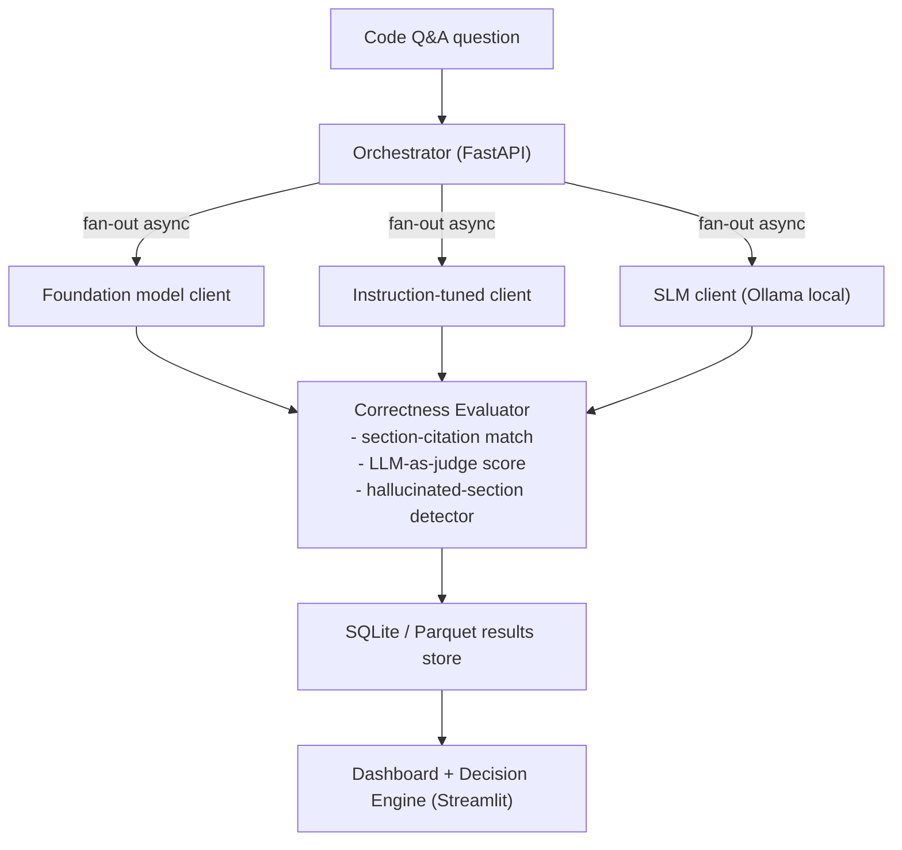

# Project Specification: Florida Building Code Model Selection Assistant

## 1. Objective

Build a service that:

1. Accepts a building-code question once (e.g., "What is the minimum egress width for a Naples single-family residence?").
2. Dispatches it concurrently to three model classes: foundation, instruction-tuned, SLM.
3. Records latency (p50/p95), token cost, and — critically — **correctness against the actual code text**, not just fluency.
4. Renders a comparison dashboard and exports a reproducible benchmark report, plus a decision engine recommending which model class to trust for which query type.

The deliverable is a defensible answer to: "For Florida/Naples building code lookups, which model class should you actually use, and when do you need retrieval grounding instead of trusting the model's parametric knowledge?"

## 2. Scope boundaries

**In scope:**

- Text-only code questions (multimodal is deferred to Lesson 4 — used for site plans / diagram-bearing questions only)
- 3 model classes, minimum 1 model per class
- A fixed evaluation set of at least 25 questions drawn from real FBC chapters (e.g., Chapter 10 Means of Egress, Chapter 16 Structural Design — wind loads relevant to Naples' hurricane zone, Chapter 18 Soils and Foundations) and Naples/Collier County-specific amendments (floodplain, elevation certification, CCCL, local FBC administrative amendments, LDC dimensional standards). The provided set (`data/fbc_eval_questions.csv`) contains 45 verified rows across four categories — `definitional`, `numeric`, `state_amendment` (Florida-statewide requirements distinct from the ICC base code), and `jurisdiction_amendment` (Collier County / City of Naples local code) — the local-code rows verified against the published Municode/ordinance text (sources in `data/corpus/`). Extend it as needed for your own coverage priorities.
- Gold answers sourced directly from the published code text, with section citations
- LLM-as-judge scoring plus one deterministic metric (section-citation exact match)
  **Out of scope (explicitly):**
- Legal advice or permitting decisions — this is a research/reference tool, not a substitute for a licensed architect, engineer, or the Naples/Collier County building department
- Fine-tuning any model (conceptual only in Lesson 5)
- Full advanced-RAG build (query rewriting, hybrid search, reranking — that is a follow-on project; this series only tests whether basic grounding changes the answer)

## 3. Architecture

## 4. Milestones (maps to lessons/)

| Milestone | Lesson                        | Deliverable                                                                                                                                                                                                |
| --------- | ----------------------------- | ---------------------------------------------------------------------------------------------------------------------------------------------------------------------------------------------------------- |
| M1        | 01 — Foundation LLMs          | Base client for a foundation model, run cold (no retrieved context) against FBC questions; log raw answers and any section citations it invents                                                            |
| M2        | 02 — Instruction-tuned models | Second client with a mid-tier instruction-tuned model; diff harness on structured questions ("return the required setback in feet as JSON")                                                                |
| M3        | 03 — SLMs                     | Local SLM client via Ollama; measure whether it can even name correct FBC chapter numbers cold, and its throughput/cost profile                                                                            |
| M4        | 04 — Multimodal models        | Route site-plan / diagram-bearing questions (e.g., reading a setback diagram) to a vision-capable model                                                                                                    |
| M5        | 05 — Fine-tuned models        | Breakeven model: at what query volume would fine-tuning a small model on FBC text beat prompting a foundation model, for a permitting-software vendor's use case                                           |
| M6        | 06 — RAG-integrated models    | Inject actual FBC/Naples code passages as context; measure the drop in hallucinated section numbers per model class                                                                                        |
| M7        | 07 — When to use each         | Decision engine: given query type (definitional lookup vs. numeric requirement vs. Florida-statewide amendment vs. county/city-local amendment) and cost/latency constraints, recommend a model class + whether grounding is mandatory |

## 5. Evaluation rubric

| Dimension                    | Metric                                             | Method                                                       |
| ---------------------------- | -------------------------------------------------- | ------------------------------------------------------------ |
| Latency                      | p50 / p95 (ms)                                     | Wall-clock per request, 10 runs per question                 |
| Cost                         | $ per 1K requests                                  | Token count × published price per model                      |
| Section-citation accuracy    | Exact match vs. gold section number                | Deterministic string/regex match                             |
| Numeric-requirement accuracy | Exact/tolerance match (e.g., setback in feet)      | Deterministic comparison                                     |
| Hallucination rate           | % of answers citing a nonexistent or wrong section | Manual + regex cross-check against a section-number index    |
| Reliability                  | Failure rate                                       | % of requests that error, timeout, or fail schema validation |

## 6. Publication plan

- GitHub repo, MIT license, README with reproduction steps and a clear disclaimer that this is a research tool, not authoritative code-compliance guidance
- Results committed as CSV/Parquet, including every hallucinated-citation example found
- Blog post / HN post: "Can an LLM correctly cite the Florida Building Code? A measured comparison across model tiers, with and without retrieval grounding"
- Lead with the failure cases (invented section numbers) — this is the finding that earns credibility with an AEC/compliance-software audience
